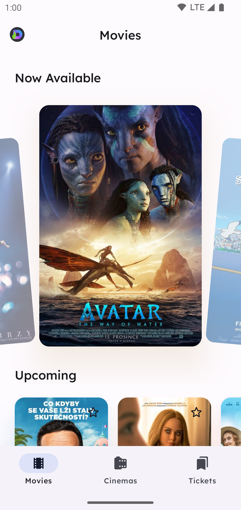
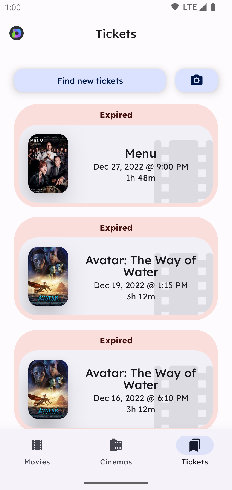

  

<h1 align="center">Movie Metropolis</h1>

   
   
   

> **Disclaimer:** This repository is not affiliated with Cinema City or its parent company in any
> way. Resources provided are however the property of Cinema City. Cinema City carries no
> responsibility for this application.

Welcome to the Movie Metropolis! 🎬 This project offers a completely redesigned and visually stunning
user experience. It serves as an insightful resource for both users and professional developers,
providing a sneak peek into the first-class Android app development using modern technologies.

## Key Features

- **Modern Architecture:** Built using Jetpack Compose and Clean Architecture.
- **Google Play Services:** Integration of various Google Play services, including Billing, OneTap,
  Update, Review, and Location.
- **Jetpack Compose:** Features Startup, Room, Work, Wear and Splash.
- **UI Components:** Utilizes Jetpack Compose and Material3 for a sleek and consistent user
  interface.
- **Instant App Support:** Install as an Instant App without the need for a full installation.
- **Dependency Injection:** Powered by Hilt for efficient and modular dependency injection.
- **Testing:** Features a fully tested business core to ensure reliability and stability.

## Enhanced Cinema City Features

In addition to replicating Cinema City's functionalities, this clone goes beyond by incorporating:

- **External Data Integration:** Search for ratings, actors, and posters from external sources (
  note: availability may vary).
- **Eye-Catching Screenshots:** Explore the application through eye candy screenshots showcasing the
  current state of the app.

## Technologies Used

- **Jetpack Compose:** Building modern UIs with a declarative approach.
- **Material3:** Stylish and consistent design components.
- **Coil:** Image loading library for efficient handling of visuals.

## Screenshots

    
    
    
    
    
    

    
    
    
    
    
    

## How to Use

1. Clone the repository.
2. Open the project in Android Studio.
3. Explore the codebase, UI, and features.
    1) Note that you are not able to build the project due to proprietary information needed to
       access the API.

Feel free to report issues, or use this codebase for educational purposes. Remember,
this project is not associated with Cinema City or its parent company.

Happy coding! 🚀

---

## Q&A

### Is this app an official product?

No, it is not an official product. Cinema City has not officially endorsed or supported the
development of this application. While open to negotiations, the project is an independent effort.

### Does a public API exist?

There is no indication of a public API for Cinema City. The app utilizes proprietary access
credentials, limiting public access. These credentials are not published in the repository but are
bundled with the application.

### Why bother making a clone?

The motivation stems from frustration with Cinema City's current application, perceived as
low-effort. Additionally, the developer believes in elevating Android to a superior platform and is
committed to creating exceptional designs and code for the platform.

### How did you do it?

Dismantling apps is not overly complex. The developer utilized resources bundled with the original
app, copying and pasting them into this project. Overcoming state-of-the-art obfuscation techniques,
the code was then analyzed to understand the inner workings, leading to the creation of this
independent project.

### Can you please add XYZ support to the app? Why not?

Adding specific features, like XYZ, is unlikely unless there's a personal benefit. The substantial
time investment in replicating the entire application requires justification. While the desire is to
create open-source first-class experiences, the financial return is limited. As of now, the project
has already incurred a cost exceeding €25k, and its value increases with additional features or
fixes.

[ext-app]: https://play.google.com/store/apps/details?id=cz.cineworld.cinemacity