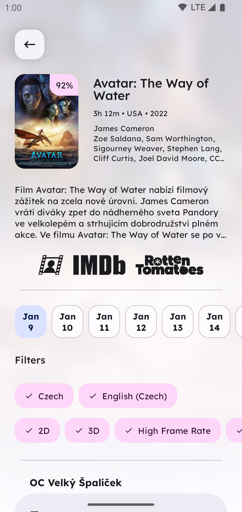
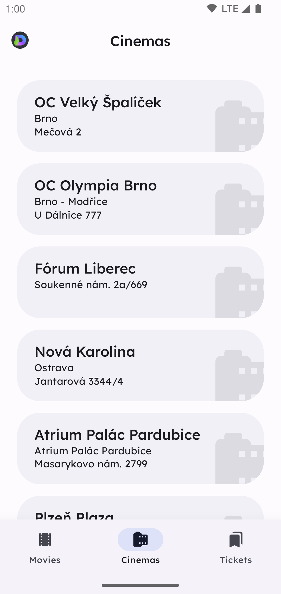
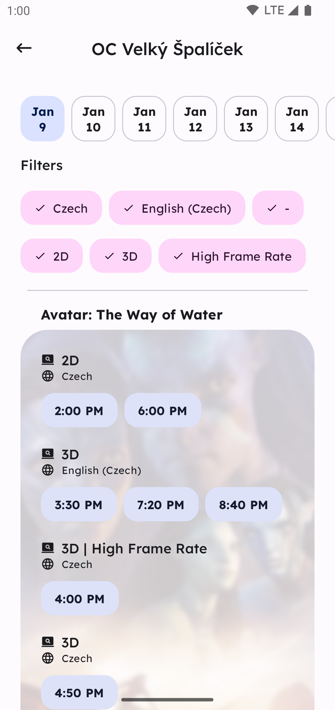

  

<h1 align="center">Movie Metropolis</h1>

   
   
   

Movie Metropolis is a fully open-sourced version of a Cinema City [application][ext-app] which is
more secure and useful
than anything that CineWorld can provide to its users.

> _This is a fan-made application and has no formal ties to Cinema City or CineWorld (its parent
company). Though all
resources used are direct property of Cinema City (CineWorld respectively) and must be treated as
such. Cinema City
carries no responsibility for this application._

It has complete feature parity with the original application, which means:

- View Current and Upcoming movies
- View Showings in and nearby or country-wide Cinema City cinemas
- Manage your own profile (and obviously log-in)
- Manage your purchased tickets
- Purchase or Book tickets
- And more to come in the future!

The convenience king and power user's dream. Movie Metropolis is becoming a power user (fan) dream
built by the
community for the community. It's more secure than the original application and provides more
options to save, filter,
favorite and more.

## Screenshots

    
    
    
    
    

    
    
    
    
    

## Q&A

### Is this an official product?

No.

### Does CineWorld have a public API?

No as far as I'm aware there's no published API. Everything present in the application is extracted
from their mobile
client. There are however some keys that should remain private, therefore are not published within
this repository.

As far as I can tell, they have regional APIs (CZ, SK, HU, …), but that's perhaps deployments of the
same app pointing
to a different database of users. Who knows, doesn't matter. The API should be the same if the URLs
are swapped for the
regional variants.

### How did this came to be then?

I got frustrated by the incredibly low quality effort they provided for their app and since I like
to go to movies, I'd
like to be greeted with the experience I deserve :)

Their app got completely disassembled and the models, APIs and internal logic (it there were any)
got pulled away. They
didn't make it exactly easy, but wasn't too hard either. I'm though not reusing any libraries or
pieces of code they had
in their application. Everything was only used to inspect how it should essentially work.

[ext-app]: https://play.google.com/store/apps/details?id=cz.cineworld.cinemacity